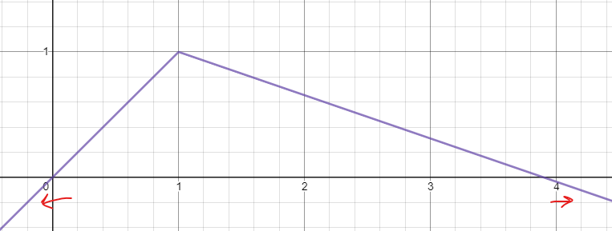
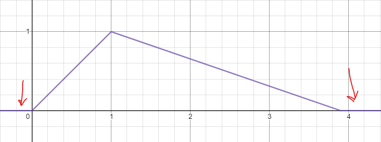
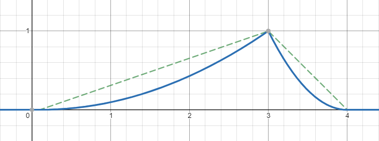

repository# Creating Complex Animations
I mentioned in the last section that a benefit of the refactors that we did to implement animations meant that we can easily modify it again to allow for more complex animations. In this example We are going to add a "comet" style animation. Now parts of what I am going to go through will be common to adding any advanced animation. As soon as I switch to writing the specific code to the animation I am going to add I will say so.


## The Changes
So to start we need to do some renaming. We are going to rename our `Animation` class from before to `SimpleAnimation`. This is so we can use `Animation` for a more general type. So to do this we need to change a few things. Firs things is to rename `Animation.mjs` to `SimpleAnimation.mjs`. And inside that file change the
```js
export default class Animation {
```
line to
```js
export default class SimpleAnimation {
```

and in `index.mjs` replace
```js
import Animation from 'Animation.mjs'
```
with
```js
import SimpleAnimation from 'SimpleAnimation.mjs'
```

and replace any references to `Animation` in `index.mjs` with `SimpleAnimation`. This will essentially rename `Animation` to `SimpleAnimation`

Once that is done we want to create a new file with the name `Animation.mjs`. This class will serve as a general base for all animations. It wont animate anything on it's own but will mean that we can make sure that all animations will behave in a certain way that our code can expect. Inside this file we want to add this content:
```js
import chroma from 'chroma-js'; //Again we want to be able to use chroma.

export default class Animation {
  //This constructor will take all of the properties that are common to all animations. This includes a looping property as well as a blending mode.
  constructor(looping = false, mode = 'lab') {
    //This line just makes sure we dont try to create an instance of Animation as it won't do anything on it's own. We will implement different animation types as sub-classes of Animation. So we won't run "new Animation(...)", instead we will run "new SimpleAnimation(...)"
    if (this.constructor === Animation) throw new TypeError("Animation should not be instantiated directly. Use one of the sub classes to create an animation.")
    //Store these settings on the animation.
    this.looping = looping;
    this.mode = mode;
  }

  //This funtion will let us check if this animation is going to modify a particular LED.
  hasPixel(index, time) {
    //The code we will write later will override this for each animation type. This is just to make sure we do so.
    throw new TypeError("You should not call Animation.hasPixel() this should be overriden by a sub class.")
  }

  //This function will get the color for a particular LED at a particular time.
  getLEDColor(index, time) {
    //The code we will write later will override this for each animation type. This is just to make sure we do so.
    throw new TypeError("You should not call Animation.getLEDColor() this should be overriden by a sub class.")
  }
}
```

This essentailly tells JavaScript that we want a general type Animation with some basic parameters so that when we create our custom animation later our code will be able to work with them.

Now back in `SimpleAnimation.mjs` at the very top we want to add this line:
```js
import Animation from 'Animation.mjs';
```
and we want to make a small change to the `export default class` line. After the `SimpleAnimation` name we want to add `extends Animation`. So it will end up looking like this:
```js
export default class SimpleAnimation extends Animation {
```

This tells JavaScript that `SimpleAnimation` is an `Animation` and that we will write `hasPixel()` and `getLEDColor()` methods for it. In this case these already exist from the last part so we have already met that condition. Now we can specify `SimpleAnimation` in any place from the last part that would take an `Animation`. This includes in the `AnimationManager`. Now note that we haven't changed the import at the top of `AnimationManager.mjs`, and that's because we want that file to use the general base type.

Now there is one other requirement of our new animation classes. Any custom animation must also specify a `totalTime` property. This is because how the `totalTime` works is not always the same and can't always be calculated straight up, as we will see later. So we just have to remember that this needs to be specified in some way for any custom animations, otherwise the `AnimationManager` won't know when the animation has finished.

## Writing a Custom Animation
From here on most of the code is unique to this 'comet' animation type but it still provides a good example for writing your own.

So to start we create a new file to keep our class. For this example we will create `CometAnimation.mjs`. Create that in the same folder as all of our other code. Inside this file add these lines:
```js
import Animation from './Animation.mjs'

export default class CometAnimation extends Animation {

}
```

This adds the new `CometAnimation` class that we will write our custom animation code in.

Inside the `CometAnimation` class add these 5 functions:
```js
constructor(headColor, tailColor, tailLength, speed, from, to, loop = false, pingPong = false, mode = 'lab') {
  //A CometAnimation will have several properties.
  /*
  headColor: the color of the start of the 'comet'
  tailColor: the color of the tail of the 'comet'
  tailLength: how long (in LEDs) that comet is. That is how many LEDs behind the head will be fading out.
  speed: the speed of the comet in LEDs / second.
  from: the starting position of the comet as an LED index.
  to: the finishing position of the comet as an LED index.
  loop: whether the animation should loop.
  pingPong: whether when the animation is looping if the comet should reverse direction when it hits the ends or not. If this is true it will bounce between the from and to positions. If not the comet will return to the start and loop over.
  mode: the blending mode of the animation.
  */

  //Here the super keyword refers to the Animation class as that is the super-class of this CometAnimation class.
  super(loop, mode);//We pass loop and mode to the Animation type as they are common to all animations.
  //We then store all of these properties in the respective properies on the instance.
  this.headColor = chroma(headColor);
  this.tailColor = chroma(tailColor);
  this.tailLength = tailLength;
  this.speed = speed;
  this.pingPong = pingPong;
  this.from = from;
  this.to = to;
  //Length is just the length of the segment that this animation plays over.
  this.length = this.to - this.from;
  //totalTime is the total time it takes to play through 1 loop of this animation. For a pingPong animation this is how long it takes to reach the end and get back to the start. As mentioned before this is necessary for the AnimationManager to accept it.
  this.totalTime = (this.length / (this.speed/1000))*(this.looping&&this.pingPong?2:1);
}
//This is from the base Animation class. It returns whether this animation is controlling an LED at that particular point in time.
hasPixel(index, time) {

}

getLEDColor(index, time) {

}
```

So as I said earlier we need to specify the `totalTime` property as well as the `hasPixel()` and `getLEDColor()` methods so that the `AnimationManager` can work with it. So we will start by implementing the `getLEDColor()` method.

The way this animation is going to work is that it is going to be a 'comet' that goes along the LED strip with a trail. It will be made up of an LED at the head with the `headColor` color and then behind that a trail of `trailLength` LEDs that fade to `tailColor` as it moves to the end of the trail. It will also fade out over the same distance so the last LED will be only slightly lit while the head LED will be fully on. So to implement this we need a few equations. The first will be the alpha of the animation layer. We'll write this based off of a curve defined by our equation. Don't worry too much though as I'll do all of the maths and figuring out the equations, I just need to explain how they work and why we have them. A good toll to use to both visualise and create your own curves is [Desmos](https://www.desmos.com/calculator). It provides a graphing tool that you can use to visualise the equations as well as animate them with parameters.

Our first equation is the position of the comet at any point in time. Because the comet is moving at a constant speed we can use some simple linear equations to determine this. Our first part is the variable `p`. This is the proportion of the animation that we are through. So at the start of the animation it is 0 and by the end it has reached 1.


From that we can calculate the position of the comet head. Now there are two equations for doing this and which one we use depends on if this is a pingPong comet or not. So for the basic animation it is as simple as:


But for a pingPong animation it is a bit more complex:


This is because it needs to bounce back and forth in one loop.

Once we have determined our equations we can write the code for this function. So inside the `CometAnimation` class add this function:
```js
getCometPos(time) {
  let p = time/this.totalTime;
  return this.length * (this.looping&&this.pingPong?2 * Math.min(1-p, p):p) + this.from;
}
```

The next step is to figure out what direction the comet is moving. For non-looping and the simple non-pingPong loop animations this is always positive (the position increases with time). However for the pingPong form we need to figure out if it is going back to the start as we want the trail behind the comet. To do this it is just as simple as a small check on the time. So in the `CometAnimation` class add this method:

```js
//This will return the direction the comet is going at any point in time. It is 1 if it is heading to the right and -1 if going to the left. It is used to figure out what side the trail should come from.
getDirection(time) {
  //We check if this is a pingPong animation. If so we return 1 id the time is less then half the totalTime and -1 otherwise. If this isn't a pingPong animation we just return 1 as it is always positive.
  return this.looping&&this.pingPong?Math.sign(this.totalTime/2 - (time % this.totalTime)):1
}
```

Now that we know where the comet is and what direction it's going we can now figure out the alpha for each pixel on the strip. The equation to do so is fairly complex but that's only because it's made of a few equations combined together.

There are two main equations and they are just straight lines that meet to make a triangle that has a peak over out comet position. The slope of these lines is determined by a few parameters. The length of the trail and the direction the comet is going. To do this we need two variables `leftL` and `rightL`. This is the length of the fade for the left and right sides of the comet head.

They can be calculated like so:
```js
let leftL  = this.getDirection(time)==1?1:this.tailLength;
let rightL = this.getDirection(time)==1?this.tailLength:1;
```

When the comet is moving in the positive direction then the tail on the "left" should be the trailLength and the fade on the "right" should be 1. These swap when the comet is going in the other direction.

With these variables we can calculate the line equation for both sides. We will use `z` to denote the position of the comet head form `getCometPos()`:

The left side is: 

And the right: 

And to combine them to get the final equation we use min(). Because the point that these lines cross is right above the position of the comet we can use min to get the parts of the lines that make our fade curve.


Now if you plot this curve on Desmos you'll see that outside the triangle and past the trailLength the curve dips into the negatives.



To stop that we will take the max of this curve and 0.




And that's it. We can now convert this into code.
So inside the `CometAnimation` class add this function:
```js
//This will get the alpha of a pixel at any point in time.
getPixelAlpha(index, time) {
  let leftL  = this.getDirection(time)==1?1:this.tailLength;
  let rightL = this.getDirection(time)==1?this.tailLength:1;
  let z = this.getCometPos(time);
  return Math.max(0, Math.min((z-index)/leftL + 1, (index-z)/rightL + 1))
}
```

And thats the alpha for our LEDs. The next step is to calculate the colors. For this we can re-use the alpha function as it goes from 1 to 0 as we move from the head to the tail. The only problem is that the tail color won't be very visible as it would have faded out at the same time it has faded to the trail color. So we can do one simple modification. If we square the result of the alpha equation we get a curved triangle like so:



In this graph the dotted line is the original alpha equation and the solid one is the squared result. This means that the color would fade to the tail color faster that the LEDs would fade out. This also means we only need to calculate the alpha equation once.

So to add the colors we add the last function. Inside the `getLEDColor()` function add this code:
```js
let a = this.getPixelAlpha(index, time)//Here we calculate the alpha.
return chroma.mix(this.tailColor,this.headColor,a**2).alpha(a);//Here we raise a to the 2nd power for the mixing ratio and set the alpha to a. If the colors don't fade fast enough you can increase the 2 to a bigger number. The bigger the number the faster the head color will change to the tail color.
```

And that's it. We can now go back to the `index.mjs` file and add this line to the top, after the `SimpleAnimation` import:
```js
import SimpleAnimation from './SimpleAnimation.mjs';
import CometAnimation from './CometAnimation.mjs';
```

And in the map of our animations you can add a new one using the comet animation, like so:

```js
animations.set('cheer', new CometAnimation("#ff0000", "#ff7700", 10, 10, 0, 100))

//And after configuring the tmi client:

client.on('cheer', ()=>{
  animationManager.play(animations.get('cheer'))
})
```

And now the comet animation will play on cheer events.

This system can be expanded to much more complex animations. It's up to you to find good combinations, colors and style that you like. I will slowly create some example animation types, but they won't have in depth tutorials like this, just comments explaining parts of the code that are unique or interesting.

That's the end of this tutorial, much of what comes next depends on what you want to add to your system. With some research you might be able to add other devices and or displays. Some good resources are the various documentation sites for these libraries we have used. These can be found linked in the first page of this tutorial, or by searching the library name and the word documentation.

As mentioned in the first page of the tutorial, the example code is slightly different to that of the tutorial as I have added a few bits that enable the use of the code in a web browser so that I could test easier. If you do decide to clone the repository and want to use these tools you can install a package called `lite-server`. It runs a private webserver on your machine and will provide the files in this folder to the browser.

To install it just run
```sh
npm install -g lite-server
```

and then in a terminal inside the project folder just run the command
```sh
lite-server
```

This will open a new tab in the browser with a URL similar to `http://localhost:3000`. This is the address of the temporary server it is running. To access the simulations just add `/test.html` to the end of the address and you should get a page with a line of black dots and some buttons. The dots simulate the LEDs and the buttons will play various animations. To write your own and see what they look like open up `test.js` and look for the line
```js
const animations = [
  //There will be a few pre-defined animations here
]
```

Either modify the existing ones or add new ones to the list. New buttons will automatically show up for each animation and you can experiment with the various example animation types.
